# A Preliminary Introduction about Hadoop — Concepts and Ideas

I have spent several days in studying Hadoop. Here I would like to write some notes about the concept and ideas behind the Hadoop project. This blog will not show any technique details, but focus on the preliminary ideas. You can download the PDF slides [here](./Preliminary-study-about-Hadoop-Songcy.pdf).

## 1. Background
“Big data” — this word is everywhere. We are living in the century of data. The amount of data grows explosively. The following figure predicts the amount of data in the next few years. From the figure we know that the growth of data is quite rapid.

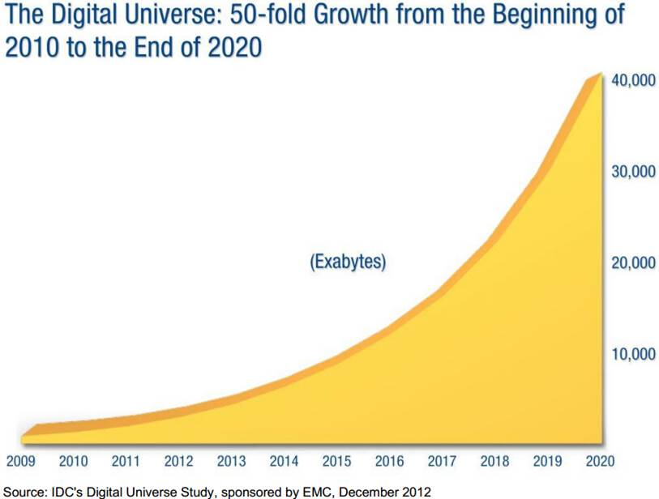

In accordance with the growth of data, the storage capacity of hard drives also increased massively. However, the access speed (the data transfer rate in reading and writing) has not kept up, which means we have to spend a lot of time for data reading and data writing, compared to the capacity of hard drives. The following figure compares the capacity and data transfer performance of hard drives. As it shows, the difference becomes more and more significant.

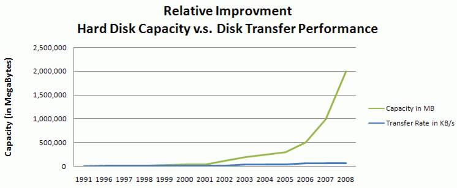

Currently if we have 1TB of data on a hard disk, we need more than 2.5 hours to read all the data! Therefore, in the age of big data, the low data access speed is the bottle neck for data storage, retrieval, and analysis. How to deal with the bottle neck? Some people came up with the idea of multiple hard drives and parallel computing.

The following figure demonstrates a coarse model for multiple hard drives. At first, we split our data into pieces. Each piece of data is stored on a separate hard drive. When we want to analyze the data, each hard drive will read and process one piece of data respectively. Then the results are merged to get the final conclusion. Since one hard drive only need to read a piece of data, the data access time can be shortened.

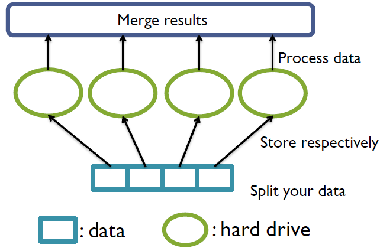

One question may be as follows:

> Isn't it a waste of hard drive space if we use multiple drives to store only one dataset?

Yes, it is really a waste of space. However, imagine if we have multiple datasets (or multiple users of this system), we can do the same to all the datasets. Then the space of hard drives can be more efficiently utilized. At the same time, the data access time for each dataset will be shortened as long as we don't analyze all datasets at the same time!

Then we may want to build one such kind of system. But we will confront some problems. The first problem is about hardware failure rate. Although an individual hardware has a relatively low failure rate, the failure rate of a group of hard drives will be high, since the system fails as long as one of the drives fails. The second problem is in which way can we combine the data from multiple drives? There are also other problems need to be addressed.

With consideration of these problems, Hadoop is such kind of system for distributed computing! The Hadoop project provides you the concept, ideas and framework. It also offers a system for installation. You can install the Hadoop system on a single machine or on a group of computers. It is somewhat like the operating system designed for computer cluster. Hadoop also provides libraries so that you can write your own applications to interact with the system, and to analyze your own dataset.

## 2. Overview of Hadoop
Hadoop is a top project. It has several subprojects. Each subproject deals with one aspect of distributed computing. The following is a list of Hadoop subprojects, but not the full list.

* HDFS: a distributed filesystem
* MapReduce: a distributed data processing model and execution environment
* Pig: a data flow language and execution environment for exploring very large datasets
* HBase: a distributed, column-oriented database
* ZooKeeper: a distributed, highly available coordination service
* Hive: a distributed data warehouse

This a graphic demonstration of Hadoop subprojects.

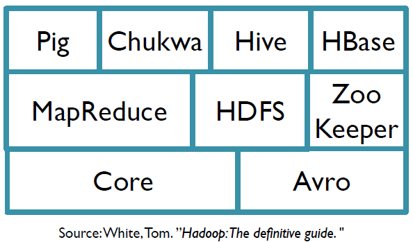

Two important subprojects are HDFS and MapReduce, which are designed for data storage and data analysis respectively. These two parts provide systematical solution to the pre-mentioned problems.

## 3. Hadoop Subprojects
### 3.1 HDFS
HDFS is short for Hadoop Distributed FileSystem. As you can see from the name, it manages the storage across a network of machines. HDFS is suitable for

* Very large files (GB or TB sized)
* Streaming data access (write once, read many times)
* Commodity hardware (it doesn't require expensive or special hardware)

HDFS is not suitable for

* Low-latency data access (HDFS needs some time to find the location of the file)
* Lots of small files (i.e. billions of small files)
* Multiple writers, arbitrary file modifications
The reason lies in the mechanism of HDFS. The structure of HDFS is like this.

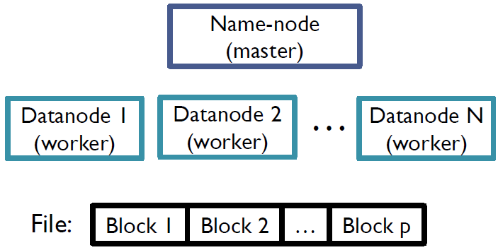

Files in HDFS are broken into equal-sized blocks (e.g. 64MB). The block size is the minimum amount of data that the system can read or write. Blocks from the same file are stored independently. As mentioned before, a group of hard drives is not reliable. Thus each block is replicated (e.g. 3 copies) in case of hardware corruption.

Datanodes are workers. A datanode is responsible for storing and retrieving file blocks. It also reports to namenode periodically with the list of blocks that it is storing. I think a datanode can be regarded as a computer in the network.

Namenode is the heart of the system, the master. It maintains the filesystem tree and metadata for all the files and directories in the tree. The tree looks like this.

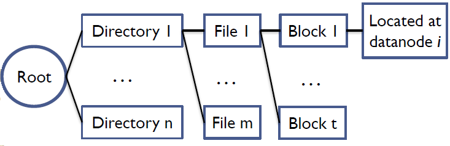

At first, there is a root directory. The root contains several sub-directories. Each directory has several files and each files is divided into blocks. Since datanodes report to namenode periodically with block lists, the namenode knows which datanode that a block is located at.

This is the data reading process in HDFS.

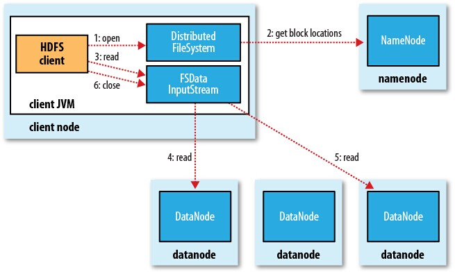

At first, the system will refer to the namenode to get the list of blocks of the file as well as block locations. Then the InputStream will read every blocks from the corresponding datanode simultaneously.

This is the data writing process of HDFS:

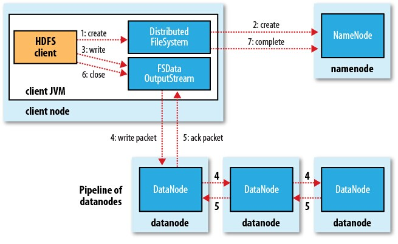

At first, the system will refer to the namenode to check if the file already exists in the system or not. If it doesn't exist, the namenode will create the file in the filesystem tree. It also provides a list of datanodes that the blocks of the file can be stored. Then OutputStream will write each block into datanodes. Since each block is replicated several times, it is written to a pipeline of datanodes. That is, after it is written to the first datanode, it is passed to the second datanode, then the third, which can be specified by the user.

### 3.2 MapReduce
MapReduce is a parallel data-processing model for distributed computing. In this model, the work that we want to do is divided into two phases: the map phase and reduce phase. Each phase has its input and output, in a (key, value) format.

Here is an example. We want to find the highest recorded temperature for each year in the dataset. The input is a large file with each line containing various information for a specific day. In map phase, we extract year and temperature from each line. Since each line is about a day, a year contains multiple lines in the output of map phase. Thus we merge the map output for each year, which is called shuffle. Then we use reduce functions to calculate the maximum temperature for each year. The process is like this.

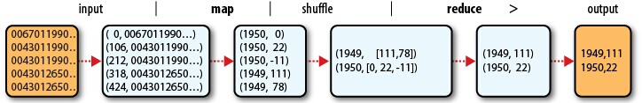

So how MapReduce used for distributed computing? In MapReduce, what we want to do is defined as a *job*. A job is divided into multiple *tasks*, including map tasks and reduce tasks. Accordingly, input dataset is split into equal-sized pieces (actually this is what HDFS does) and each task deals with one piece of dataset. *Jobtracker* and *tasktrackers* are used for coordination. The following figure shows the process of parallel computing.

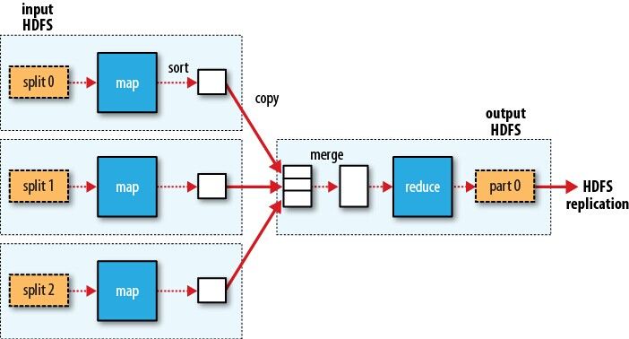

For each split of the input dataset, we apply a map function. Then we merge the map output as the input to the reduce function to get the result. Please note that map functions can be done simultaneously but reduce phase always follows map phase. If we have multiple reduce functions, the process is like this:

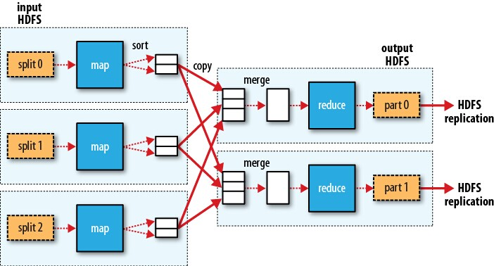

Hadoop does its best to run map task on the computer where input split resides in HDFS, which is called data locality optimization. That is, the computer where the input split is located, is responsible for running map task on the input split. If we use another computer, the input split must be transferred to the computer through the network, which will occupy the bandwidth resource. Therefore, data locality decreases the data transfer through the network. However, reduce tasks don't have the advantage of data locality. All the output of map functions must be transferred to a specific node for reduce task. In order to minimize data transfer, combiner functions can be used between map and reduce to discard unnecessary information in map output. Take the highest temperature as an example. A combiner function can be applied after shuffle, to calculate the local maximum annual temperature in each split of the input dataset.

The following figure shows the process of a MapReduce job. At first, the job is assigned an ID for specification. Then it refers to the filesystem to get job resources such as configuration information. After the job is submitted to jobtracker, it will be initialized. The jobtracker also retrieves input splits from the filesystem and set up a map task for each split. The number of reduce tasks is determined by user configuration. Tasktrackers receive tasks and report to the jobtracker about the status of the tasks periodically.

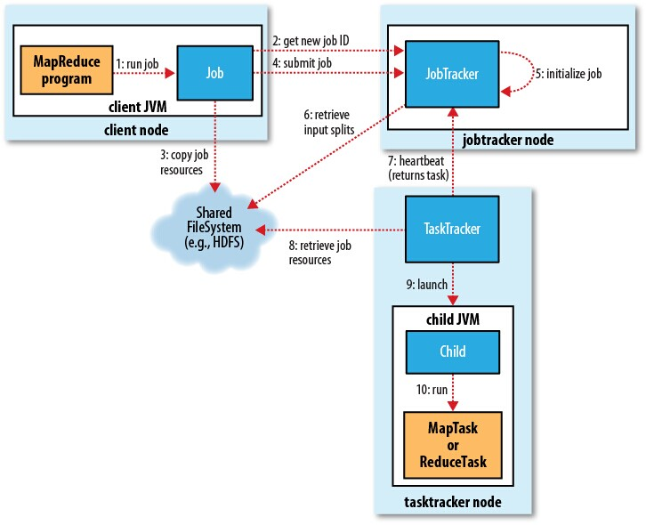

There is a new system called YARN sharing similar function as MapReduce. Since I didn't dig into this subproject, I will not discuss YARN here.

MapReduce deals with low-level operations. With only MapReduce, we have to care about the data flow details. Therefore, we need some advanced tools to help us focus on data itself and deal with the technique details. In the next subsection, I will introduce three high-level subprojects.

### 3.3 Other Subprojects
#### 3.3.1 Pig
Pig is the language and execution environment for processing large datasets. Pig consists of two pieces: Pig Latin, which is the language to express data flow, and the execution environment to run Pig Latin programs.

Pig Latin program consists of a series of operations or transformations applied to input data. It can be translated into a series of MapReduce jobs by Pig execution environment so that the Pig Latin language can be understood by Hadoop system. Take the highest recorded temperature for example. With Pig, we only need a few lines to complete the work.

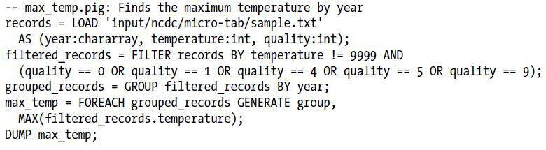

#### 3.3.2 HBase
HBase is a distributed column-oriented database built on HDFS. Although it is a database, it doesn't support SQL. The idea is that if the table grows too large, it is automatically partitioned into regions horizontally (each region contains multiple rows from the table). Similar to HDFS and MapReduce, it has a master-slave structure. It uses a master node to manage the whole space and regionserver slaves to manage one or more regions.

#### 3.3.3 Hive
Hive is a data warehouse infrastructure built on top of Hadoop. It supports the Hive Query language – very similar to SQL. Therefore you can get familiar with Hive very quickly if you are familiar with traditional database.

## 4. Summary
Hadoop is a collection of subprojects used for parallel data storage, retrieval & analysis in a group of computers/hardwares, in order to mitigate the data access bottleneck in hard drives.

### For more information
* White, Tom. "Hadoop: The definitive guide." O'Reilly Media, Inc., 2012.
* Apache Hadoop homepage http://hadoop.apache.org/

### Reference
* White, Tom. "Hadoop: The definitive guide." O'Reilly Media, Inc., 2012.