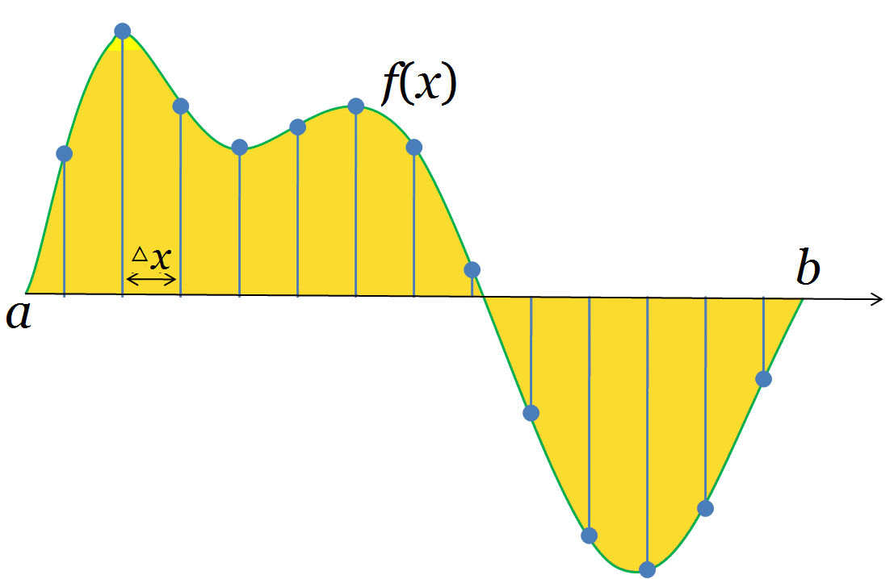

# A Story of Basis and Kernel - Part I: Function Basis
## 1. Review of Basis Concept

We know that everything in the world can be decomposed into the combination of the basic elements. For example, water is the combination of hydrogen and oxygen. Similarly, in mathematics, basis is used to represent various things in a simple and unified way.

In $\mathcal{R}^n$ space, we can use $n$ independent vectors to represent any vector by linear combination. The $n$ independent vectors can be viewed as a set of basis. There are infinite basis sets in $\mathcal{R}^n$ space. Among them, basis vectors that are orthogonal to each other are of special interests. For example, $\{\mathbf{e}_i\}_{i=1}^n$ is a special basis set with mutually orthogonal basis vectors in the same length, where $\mathbf{e}_i$ is a vector that has all zero entries except the $i$th entry which equals 1.

The inner product operator measures the similarity between vectors. For two vectors $\mathbf{x}$ and $\mathbf{y}$ , the inner product is the projection of one vector to the other.

$$<\mathbf{x},\mathbf{y}>=|\mathbf{x}||\mathbf{y}|\cos\theta$$
If $\mathbf{x}=(x_1,\cdots,x_n)$ and $\mathbf{y}=(y_1, \cdots, y_n)$, we can get 
$$<\mathbf{x},\mathbf{y}>=\sum_{i=1}^n x_i y_i$$

Until now it is a review of vector basis. These knowledge can also be extended to functions and function space.

## 2. Function Basis

A function is an infinite vector. As the following figure shows

For a function defined on the interval $[a,b]$, we take samples by an interval $\Delta x$. If we sample the function $f(x)$ at points $a, x_1,\cdots,x_n,b$, then we can transform the function into a vector $(f(a),f(x_1),\cdots,f(x_n),f(b))^T$. When $\Delta x\rightarrow 0$, the vector should be more and more close to the function and at last, it becomes infinite.

The above analysis assumes $x$ to be a real number. But when $x$ is a vector, it still holds. In this article, we use bold font such as $\mathbf{x}$ to denote a vector in $\mathcal{R}^n$ space; use $f$ to denote the function itself, namely the infinite vector; use $f(\mathbf{x})$ to denote the evaluation of the function at point $\mathbf{x}$. And the evaluation of a function should be a real number.

Since functions are so close to vectors, we can also define the inner product of functions similarly. For two functions $f$ and $g$ sampling by interval $\Delta x$, the inner product may be defined as 
$$<f,g>=\lim_{\Delta x\rightarrow 0}\sum_{i} f(x_i) g(x_i)\Delta x=\int f(x)g(x)dx$$
For a vector, the dimension is discrete. We only have the first, second,… dimension. But we don't have the 0.5, 1.5,… dimension. However, the dimension is not discrete for functions, but continuous. Thus we use the difference between adjacent dimensions (i.e., $\Delta x$ ) for normalization.

The expression of function inner product is seen everywhere. It has various meanings in various context. For example, if $X$ is a continuous random variable with probability density function $f(x)$ , i.e., $f(x)>0$ and $\int f(x) dx = 1$ , then the expectation 
$$E[g(x)]=\int f(x) g(x) dx=<f,g>$$

Similar to vector basis, we can use a set of functions to represent other functions. The difference is that in a vector space, we only need finite vectors to construct a complete basis set, but in function space, we may need infinite basis functions. Two functions can be regarded as orthogonal if their inner product is zero. In function space, we can also have a set of function basis that are mutually orthogonal.

## 3. Example: Fourier Series

Let the basis functions $\{h_p\}_{p=-\infty}^{+\infty}, (p$ is integer) be 
$$h_p(x)=e^{i2\pi p x/T}$$
defined on interval $[0, T]$. Here $i$ is the imaginary number. These functions construct a function space and any function defined on interval $[0, T]$ can be represented as linear combination of the basis functions. We can prove that any two basis functions are orthogonal (for complex numbers, the latter term should take conjugate transpose when calculating the inner product). 
$$<h_p, h_q>=\int_0^T h_p (x) \bar{h}_q(x) dx=\int_0^T e^{i2\pi p x/T} e^{-i2\pi q x/T} dx=0$$
where $p \neq q$ and $\overline{a+bi}=a-bi$. The "length" of basis is 
$$|h_p|^2=<h_p,h_p>=T$$
If a function $f$ defined on interval $[0,T]$ is within the space, it can be written as 
$$f(x)=\sum_p c_p h_p(x)=\sum_p c_p e^{i2\pi px/T}$$
Since 
$$<f,h_p>=<\sum_q c_q h_q,h_p>=\sum_q c_q < h_q,h_p>=c_p < h_p,h_p>=c_p T$$
the coefficient can be calculated as 
$$c_p=\frac{1}{T} <f,h_p>=\frac{1}{T} \int f(x) \bar{h}_p(x) dx=\frac{1}{T} \int_0^T f(x) e^{-i2\pi p x} dx$$
which is the Fourier series.

## 4. Example: Wavelet Analysis

Define function $\psi(x)$ on $\mathbf{R}$ as 
$$\psi(x)= \begin{cases} 1 \quad & 0 \leq x < \frac{1}{2},\\ -1 & \frac{1}{2} \leq x < 1\\ 0 & \text{otherwise} \end{cases}$$
Define a series of functions for every pair $n,k$ of intergers $$\psi_{n,k}(x) = 2^{n / 2} \psi(2^n x-k), \quad x \in \mathbf{R}$$ That is, we rescaled $\psi(x)$ by $2^n$ and shift by $2^{-n} k$ . We can show that 
$$<\psi_{n_1,k_1},\psi_{n_2,k_2} > = \int \psi_{n_1,k_1} (x),\psi_{n_2,k_2} (x) dx = \begin{cases} 1 \quad & n_1=n_2, k_1=k_2 \\ 0 \quad & \text{otherwise} \end{cases}$$
Any function can be represented as the linear combination of $\{ \psi_{n,k} \}_{n,k}$ . By the same technique as the former example, we can also obtain the analytical expression of the coefficient for each basis function, which is the Haar wavelet analysis.

In the next part, fundermentals about kernel functions and kernel method will be discussed.