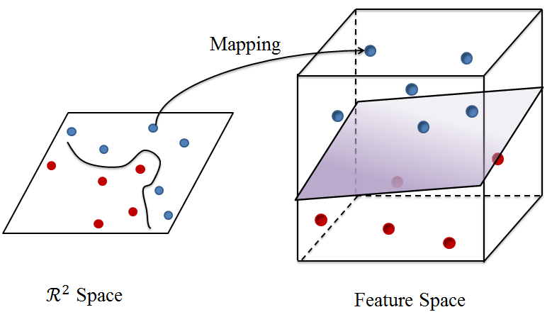

# A Story of Basis and Kernel - Part II: Reproducing Kernel Hilbert Space

## 1. Opening Words

In the [previous blog](../story-of-basis-and-kernel-part-1), the function basis was briefly discussed. We began with viewing a function as an infinite vector, and then defined the inner product of functions. Similar to $\mathcal{R}^n$ space, we can also find orthogonal function basis for a function space.

This blog will move a step further discussing about kernel functions and reproducing kernel Hilbert space (RKHS). Kernel methods have been widely used in a variety of data analysis techniques. The motivation of kernel method arises in mapping a vector in $\mathcal{R}^n$ space as another vector in a feature space. For example, imagine there are some red points and some blue points as the next figure shows, which are not easily separable in $\mathcal{R}^n$ space. However, if we map them into a high-dimension feature space, we may be able to seperate them easily. This article will not provide strict theoretical definition, but rather intuitive description on the basic ideas.

      
      

## 2. Eigen Decomposition

For a real symmetric matrix $\mathbf{A}$ , there exists real number $\lambda$ and vector $\mathbf{x}$ so that 
$$\mathbf{A} \mathbf{x} = \lambda \mathbf{x}$$
Then $\lambda$ is an eigenvalue of $\mathbf{A}$ and $\mathbf{x}$ is the corresponding eigenvector. If $\mathbf{A}$ has two different eigenvalues $\lambda_1$ and $\lambda_2$ , $\lambda_1 \neq \lambda_2$ , with corresponding eigenvectors $\mathbf{x}_1$ and $\mathbf{x}_2$ respectively, 
$$\lambda_1 \mathbf{x}_1^T \mathbf{x}_2 = \mathbf{x}_1^T \mathbf{A}^T \mathbf{x}_2 = \mathbf{x}_1^T \mathbf{A} \mathbf{x}_2 = \lambda_2 \mathbf{x}_1^T \mathbf{x}_2$$
 Since $\lambda_1 \neq \lambda_2$ , we have $\mathbf{x}_1^T \mathbf{x}_2 = 0$ , i.e., $\mathbf{x}_1$ and $\mathbf{x}_2$ are orthogonal.

For $\mathbf{A} \in \mathcal{R}^{n \times n}$ , we can find $n$ eigenvalues a long with $n$ orthogonal eigenvectors. As a result, $\mathbf{A}$ can be decomposited as 
$$\mathbf{A} = \mathbf{Q} \mathbf{D} \mathbf{Q}^T$$
 where $\mathbf{Q}$ is an orthogonal matrix (i.e., $\mathbf{Q} \mathbf{Q}^T = \mathbf{I}$ ) and $\mathbf{D} = \text{diag} (\lambda_1, \lambda_2, \cdots, \lambda_n)$ . If we write $\mathbf{Q}$ column by column 
 $$\mathbf{Q}=\left( \mathbf{q}_1, \mathbf{q}_2, \cdots, \mathbf{q}_n \right)$$
 then 
 $$
 \begin{array}{rl}
 \mathbf{A}=\mathbf{Q} \mathbf{D} \mathbf{Q}^T &= \left( \mathbf{q}_1, \mathbf{q}_2, \cdots, \mathbf{q}_n \right) 
 \begin{pmatrix} \lambda_1\ &&& \\ & \lambda_2\ && \\ && \ddots\ & \\ &&&\lambda_n \end{pmatrix} 
 \begin{pmatrix} \mathbf{q}_1^T \\ \mathbf{q}_2^T \\ \vdots \\ \mathbf{q}_n^T \end{pmatrix} \\
 &= \left( \lambda_1 \mathbf{q}_1, \lambda_2 \mathbf{q}_2, \cdots, \lambda_n \mathbf{q}_n \right)
 \begin{pmatrix} \mathbf{q}_1^T \\ \mathbf{q}_2^T \\ \vdots \\ \mathbf{q}_n^T \end{pmatrix} \\
 &=\sum_{i=1}^n \lambda_i \mathbf{q}_i \mathbf{q}_i^T
 \end{array}
 $$
 Here ${ \{\mathbf{q}_i \} }_{i=1}^n$ is a set of orthogonal basis of $\mathcal{R}^n$ .

## 3. Kernel Function

A function $f(\mathbf{x})$ can be viewed as an infinite vector, then for a function with two independent variables $K(\mathbf{x},\mathbf{y})$ , we can view it as an infinite matrix. Among them, if $K(\mathbf{x},\mathbf{y}) = K(\mathbf{y},\mathbf{x})$ and $$\int \int f(\mathbf{x}) K(\mathbf{x},\mathbf{y}) f(\mathbf{y}) d\mathbf{x} d\mathbf{y} \geq 0$$ for any function $f$ , then $K(\mathbf{x},\mathbf{y})$ is symmetric and positive definite, in which case $K(\mathbf{x},\mathbf{y})$ is a kernel function.

Similar to matrix eigenvalue and eigenvector, there exists eigenvalue $\lambda$ and eigenfunction $\psi(\mathbf{x})$ so that $$\int K(\mathbf{x},\mathbf{y}) \psi(\mathbf{x}) d\mathbf{x} = \lambda \psi(\mathbf{y})$$ For different eigenvalues $\lambda_1$ and $\lambda_2$ with corresponding eigenfunctions $\psi_1(\mathbf{x})$ and $\psi_2(\mathbf{x})$ , it is easy to show that 
$$\begin{array}{rl}
\int \lambda_1 \psi_1(\mathbf{x}) \psi_2(\mathbf{x}) d\mathbf{x} & = \int \int K(\mathbf{y},\mathbf{x}) \psi_1(\mathbf{y}) d\mathbf{y} \psi_2(\mathbf{x}) d\mathbf{x} \\ & = \int \int K(\mathbf{x},\mathbf{y}) \psi_2(\mathbf{x}) d\mathbf{x} \psi_1(\mathbf{y}) d\mathbf{y} \\ & = \int \lambda_2 \psi_2(\mathbf{y}) \psi_1(\mathbf{y}) d\mathbf{y} \\ & = \int \lambda_2 \psi_2(\mathbf{x}) \psi_1(\mathbf{x}) d\mathbf{x}
\end{array}
$$
Therefore, 
$$< \psi_1, \psi_2 > = \int \psi_1(\mathbf{x}) \psi_2(\mathbf{x}) d\mathbf{x} = 0$$
 Again, the eigenfunctions are orthogonal. Here $\psi$ denotes the function (the infinite vector) itself.

For a kernel function, infinite eigenvalues ${ \{\lambda_i\} }_{i=1}^{\infty}$ along with infinite eigenfunctions ${ \{\psi_i\} }_{i=1}^{\infty}$ may be found. Similar to matrix case, 
$$K(\mathbf{x},\mathbf{y}) = \sum_{i=0}^{\infty} \lambda_i \psi_i (\mathbf{x}) \psi_i (\mathbf{y})$$
 which is the Mercer's theorem. Here $< \psi_i, \psi_j > = 0$ for $i \neq j$ . Therefore, ${ \{\psi_i\} }_{i=1}^{\infty}$ construct a set of orthogonal basis for a function space.

Here are some commonly used kernels:

*   Polynomial kernel $K(\mathbf{x},\mathbf{y}) = ( \gamma \mathbf{x}^T \mathbf{y} + C)^d$
*   Gaussian radial basis kernel $K(\mathbf{x},\mathbf{y}) = \exp (-\gamma \Vert \mathbf{x} - \mathbf{y} \Vert^2 )$
*   Sigmoid kernel $K(\mathbf{x},\mathbf{y}) = \tanh (\gamma \mathbf{x}^T \mathbf{y} + C )$

## 4. Reproducing Kernel Hilbert Space

Treat ${ \{\sqrt{\lambda_i} \psi_i\} }_{i=1}^{\infty}$ as a set of orthogonal basis and construct a Hilbert space $\mathcal{H}$ . Any function or vector in the space can be represented as the linear combination of the basis. Suppose 
$$f = \sum_{i=1}^{\infty} f_i \sqrt{\lambda_i} \psi_i$$
we can denote $f$ as an infinite vector in $\mathcal{H}$ : 
$$f = (f_1, f_2, ...)_\mathcal{H}^T$$
 For another function $g = (g_1, g_2, ...)_\mathcal{H}^T$ , we have 
 $$< f,g >_\mathcal{H} = \sum_{i=1}^{\infty} f_i g_i$$

For the kernel function $K$, here I use $K(\mathbf{x},\mathbf{y})$ to denote the evaluation of $K$ at point $\mathbf{x},\mathbf{y}$ which is a scalar, use $K(\cdot,\cdot)$ to denote the function (the infinite matrix) itself, and use $K(\mathbf{x},\cdot)$ to denote the $\mathbf{x}$th "row" of the matrix, i.e., we fix one parameter of the kernel function to be $\mathbf{x}$ then we can regard it as a function with one parameter or as an infinite vector. Then 
$$K(\mathbf{x},\cdot) = \sum_{i=0}^{\infty} \lambda_i \psi_i (\mathbf{x}) \psi_i$$
 In space $\mathcal{H}$ , we can denote 
 $$K(\mathbf{x},\cdot) = (\sqrt{\lambda_1} \psi_1 (\mathbf{x}), \sqrt{\lambda_2} \psi_2 (\mathbf{x}), \cdots )_\mathcal{H}^T$$

 Therefore 
 $$< K(\mathbf{x},\cdot), K(\mathbf{y},\cdot) >_\mathcal{H} = \sum_{i=0}^{\infty} \lambda_i \psi_i (\mathbf{x}) \psi_i(\mathbf{y}) = K(\mathbf{x},\mathbf{y})$$
 This is the _reproducing_ property, thus $\mathcal{H}$ is called reproducing kernel Hilbert space (RKHS).

Now it is time to return to the problem from the beginning of this article: how to map a point into a feature space? If we define a mapping 
$$\bold{\Phi} (\mathbf{x}) = K(\mathbf{x},\cdot) = (\sqrt{\lambda_1} \psi_1 (\mathbf{x}), \sqrt{\lambda_2} \psi_2 (\mathbf{x}), \cdots )^T$$
 then we can map the point $\mathbf{x}$ to $\mathcal{H}$ . Here $\bold{\Phi}$ is not a function, since it points to a vector or a funtion in the feature space $\mathcal{H}$ . Then 
 $$< \bold{\Phi} (\mathbf{x}), \bold{\Phi} (\mathbf{y}) >_\mathcal{H} = < K(\mathbf{x},\cdot), K(\mathbf{y},\cdot) >_\mathcal{H} = K(\mathbf{x},\mathbf{y})$$
  As a result, we do not need to actually know what is the mapping, where is the feature space, or what is the basis of the feature space. For a symmetric positive-definite function $K$ , there must exist at least one mapping $\bold{\Phi}$ and one feature space $\mathcal{H}$ so that 
  $$< \bold{\Phi} (\mathbf{x}), \bold{\Phi} (\mathbf{y}) > = K(\mathbf{x},\mathbf{y})$$
   which is the so-called _kernel trick_.

## 5. A Simple Example

Consider kernel function 
$$K(\mathbf{x},\mathbf{y}) = \left( x_1, x_2, x_1 x_2 \right) \begin{pmatrix} y_1 \\ y_2 \\ y_1 y_2 \end{pmatrix} = x_1 y_1 + x_2 y_2 + x_1 x_2 y_1 y_2$$
 where $\mathbf{x}=(x_1,x_2)^T, \mathbf{y}=(y_1,y_2)^T$ . Let $\lambda_1=\lambda_2=\lambda_3=1$ , $\psi_1(\mathbf{x})=x_1$ , $\psi_2(\mathbf{x})=x_2$ , $\psi_3(\mathbf{x})=x_1 x_2$ . We can define the mapping as 
 $$\begin{pmatrix} x_1 \\ x_2 \end{pmatrix} \overset{\bold{\Phi}}{\longrightarrow} \begin{pmatrix} x_1 \\ x_2 \\ x_1 x_2 \end{pmatrix}$$
 Then 
 $$< \bold{\Phi} (\mathbf{x}), \bold{\Phi}(\mathbf{y}) > = \left( x_1, x_2, x_1 x_2 \right) \begin{pmatrix} y_1 \\ y_2 \\ y_1 y_2 \end{pmatrix} = K(\mathbf{x},\mathbf{y})$$

## 6. Support Vector Machine

Support vector machine (SVM) is one of the most widely known application of RKHS. Suppose we have data pairs ${ (\mathbf{x}_i, y_i) }_{i=1}^n$ where $y_i$ is either 1 or -1 denoting the class of the point $\mathbf{x}_i$. SVM assumes a hyperplane to best seperate the two classes. 
$$\min_{\boldsymbol{\beta}, \beta_0} \frac{1}{2} \Vert \boldsymbol{\beta} \Vert^2 + C \sum_{i=1}^n \xi_i$$

$$ \text{subject to } \xi_i \geq 0, y_i (\mathbf{x}_i^T \boldsymbol{\beta} + \beta_0 ) \geq 1 - \xi_i, \forall i $$

 Sometimes the two classes cannot be easily seperated in $\mathcal{R}^n$ space, thus we can map $\mathbf{x}_i$ into a high-dimension feature space where the two classes may be easily seperated. The original problem can be reformulated as 

 $$\min_{\boldsymbol{\beta}, \beta_0} \frac{1}{2} \Vert \boldsymbol{\beta} \Vert^2 + C \sum_{i=1}^n \xi_i$$
 $$\text{subject to } \xi_i \geq 0, y_i (\bold{\Phi}(\mathbf{x}_i)^T \boldsymbol{\beta} + \beta_0 ) \geq 1 - \xi_i, \forall i$$
 The Lagrange function is 
 $$ L_p = \frac{1}{2} \Vert \boldsymbol{\beta} \Vert^2 + C \sum_{i=1}^n \xi_i - \sum_{i=1}^n \alpha_i [y_i (\bold{\Phi}(\mathbf{x}_i)^T \boldsymbol{\beta} + \beta_0) - (1-\xi_i)] -\sum_{i=1}^n \mu_i \xi_i $$

  Since 
  $$ \frac{\partial L_p}{\partial \boldsymbol{\beta}} = \mathbf{0} $$
we get 
   $$ \boldsymbol{\beta} = \sum_{i=1}^n \alpha_i y_i \bold{\Phi}(\mathbf{x}_i) $$

That is, $\boldsymbol{\beta}$ can be writen as the linear combination of $\mathbf{x}_i$s! We can substitute $\boldsymbol{\beta}$ and get the new optimization problem. The objective function changes to: 
$$ \begin{array}{rl} &\frac{1}{2} \Vert \sum_{i=1}^n \alpha_i y_i \bold{\Phi} (\mathbf{x}_i) \Vert^2 + C \sum_{i=1}^n \xi_i \\ =& \frac{1}{2} < \sum_{i=1}^n \alpha_i y_i \bold{\Phi} (\mathbf{x}_i), \sum_{j=1}^n \alpha_j y_j \bold{\Phi} (\mathbf{x}_j) > + C \sum_{i=1}^n \xi_i \\ =& \frac{1}{2} \sum_{i=1}^n \sum_{j=1}^n \alpha_i \alpha_j y_i y_j < \bold{\Phi} (\mathbf{x}_i), \bold{\Phi} (\mathbf{x}_j) > + C \sum_{i=1}^n \xi_i \\ = & \frac{1}{2} \sum_{i=1}^n \sum_{j=1}^n \alpha_i \alpha_j y_i y_j K(\mathbf{x}_i, \mathbf{x}_j) + C \sum_{i=1}^n \xi_i 
\end{array}
$$
The constraints changes to: 
$$ \begin{array}{rl} 
& y_i \left[\bold{\Phi}(\mathbf{x}_i)^T \left( \sum_{j=1}^n \alpha_j y_j \bold{\Phi}(\mathbf{x}_j) \right) + \beta_0 \right] \\ =& y_i \left[ \left( \sum_{j=1}^n \alpha_j y_j < \bold{\Phi}(\mathbf{x}_i), \bold{\Phi}(\mathbf{x}_j) > \right) + \beta_0 \right] \\ =& y_i \left[ \left( \sum_{j=1}^n \alpha_j y_j K(\mathbf{x}_i, \mathbf{x}_j) \right) + \beta_0 \right] \geq 1 - \xi_i, \forall i \end{array}$$
What we need to do is determining a kernel function and solve for $\boldsymbol{\alpha}, \beta_0, \xi_i$ . We do not need to actually construct the feature space. For a new data $\mathbf{x}$ with unknown class, we can predict its class by 
$$\begin{array}{ccl} \hat{y} &=& \text{sign} \left[ \bold{\Phi} (\mathbf{x})^T \boldsymbol{\beta} + \beta_0 \right] \\ &=& \text{sign} \left[ \bold{\Phi} (\mathbf{x})^T \left( \sum_{i=1}^n \alpha_i y_i \bold{\Phi}(\mathbf{x}_i) \right) + \beta_0 \right] \\ &=& \text{sign} \left( \sum_{i=1}^n \alpha_i y_i < \bold{\Phi} (\mathbf{x}), \bold{\Phi}(\mathbf{x}_i) > + \beta_0 \right) \\ &=& \text{sign} \left( \sum_{i=1}^n \alpha_i y_i K(\mathbf{x},\mathbf{x}_i) + \beta_0 \right) \end{array}
$$
Kernel methods greatly strengthen the discriminative power of SVM.

## 7. Summary and Reference

Kernel method has been widely utilized in data analytics. Here, the fundamental property of RKHS is introduced. With kernel trick, we can easily map the data to a feature space and do analysis. Here is a video with nice demonstration on why we can easily do classification with kernel SVM in a high-dimension feature space.

<iframe width="420" height="315" src="https://www.youtube.com/embed/3liCbRZPrZA" frameborder="0" allowfullscreen=""></iframe>

The example in Section 5 is from

*   Gretton A. (2015): Introduction to RKHS, and some simple kernel algorithms, Advanced Topics in Machine Learning, Lecture conducted from University College London.

Other reference includes

*   Paulsen, V. I. (2009). An introduction to the theory of reproducing kernel Hilbert spaces. Lecture Notes.
*   Daumé III, H. (2004). From zero to reproducing kernel hilbert spaces in twelve pages or less.
*   Friedman, J., Hastie, T., and Tibshirani, R. (2001). The elements of statistical learning. Springer, Berlin: Springer series in statistics.)