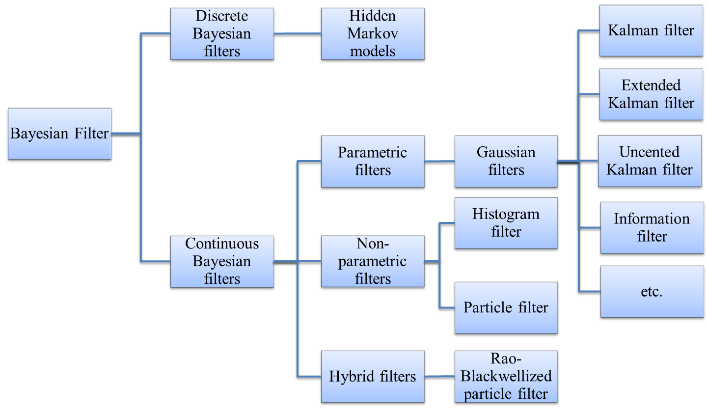

# A Summary of State-space Models
## 1. Bayesian Filter
In this article, I summarize some famous state-space models. Here I won't go into details but focus on the entire map to get an overview. All these state-space models originate from Bayesian filter. In these models, two stochastic processes are considered. The first process is **states** $x_t$, and the second process is **observations** or **measurements** $y_t$, where $t$ means "time" but generally the processes are not restricted to time series. We are interested in the true value of states, but we can only observe the value of observations. Therefore, state-space models aim to estimate states based on observations. Two relationships should be addressed:

* The state-to-state probability $P(x_t | x_{1:t-1})$
* The state-to-observation probability $P(y_t | x_t)$
No *direct* relationship exists between any two observations. A common assumption is the Markov property, which assumes that the current state depends only on the previous state, namely $P(x_t | x_{1:t-1})=P(x_t|x_{t-1})$.

## 2. Prediction and Updating
State-space model has online algorithms with recursive two steps. Prediction is to estimate the posterior distribution $p(x_t | y_{1:t-1})$ based on the distribution $p(x_{t-1}| y_{1:t-1})$, according to the state-to-state probability $P(x_t|x_{t-1})$. Mathematically,
$$
	p(x_t|y_{1:t-1})=\int p(x_t|x_{t-1}) p(x_{t-1}|y_{1:t-1}) dx_{t-1}
$$
Updating is to update the previous distribution based on the latest observation $y_t$. Mathematically,
$$
	p(x_t | y_{1:t})= p(y_t|x_t) p(x_t|y_{1:t-1}) /p(y_t) \propto p(y_t|x_t) p(x_t|y_{1:t-1})
$$

## 3. Considerations in Modeling
Bayesian filters estimate $x_t$ by the posterior distribution $p(x_t | y_{1:t})$. Usually the state-to-state probability and state-to-observation probability cannot be obtained directly when modeling practical problems. Instead, they should be inferred from prediction model $x_t=f(x_{t-1})$ and measurement model $y_t=g(x_t)$. And a series of questions must be answered:

* Is state $x_t$ discrete or continuous?
* What is the distribution of $x_t$?
* Is the prediction model linear or nonlinear?
* Is the measurement model linear or nonlinear?
According to different answers to these questions, we have different filters as follows.

## 4. Classification of Bayesian filters
Based on whether the state $x_t$ is discrete or continuous, Bayesian filters are divided into discrete filters and continuous filters. When state $x_t$ can only be discrete values, the state-to-state probability can be expressed by transition matrix $A=[a_{i,j}]$ where $a_{i,j}=P(x_t =j|x_{t-1}=i)$.

Based on whether the distribution of $x_t$ is assumed to be a specific format, continuous Bayesian filters are divided into parametric and nonparametric filters. For example , in Gaussian filters, the distribution of $x_t$ is assumed to be multivariate normal distribution. With this assumption, the posterior distribution $p(x_t|y_{1:t})$ can be expressed in close-form explicitly. On the other side, non-parametric filters don't make any assumptions in the distribution of $x_t$, but use some techniques to approximate the distribution. For example, the distribution of $x_t$ can be expressed by a histogram (Histogram filter) or a lot of samples (Particle filter) drawn from the target distribution. Non-parametric filters approximate the distribution, and put no restrictions on prediction model $x_t=f(x_{t-1})$ and measurement model $y_t=g(x_t)$, thus flexible in various situations. However, the computation load is heavy since there is no close-form expression, and the better of the approximation, the heavier of the computation burden.

Gaussian filters assume the distribution of $x_t$ to be multivariate normal distribution. In classical Kalman filter, the prediction model $x_t=f(x_{t-1})$ and the measurement model $y_t=g(x_t)$ are assumed linear in order to maintain normality. Specifically, $x_t=A x_{t-1}+ \epsilon_t, y_t=B x_t + \delta_t$. Derivatives of Kalman filter such as Extended Kalman filter and Uncented Kalman filter relax the linear relationship assumption, but approximate by linearization techniques such as Taylor expansion. Information filter and its derivatives are essentially the same to Kalman filter family, with information expression of multivariate normal distribution $\Omega=\Sigma^{-1}, \xi=\Omega \mu$.

Hybrid filters are mixture of parametric and non-parametric filters, with some dimensions of state assumed to be in specific format and other dimensions to be expressed in non-parametric techniques.