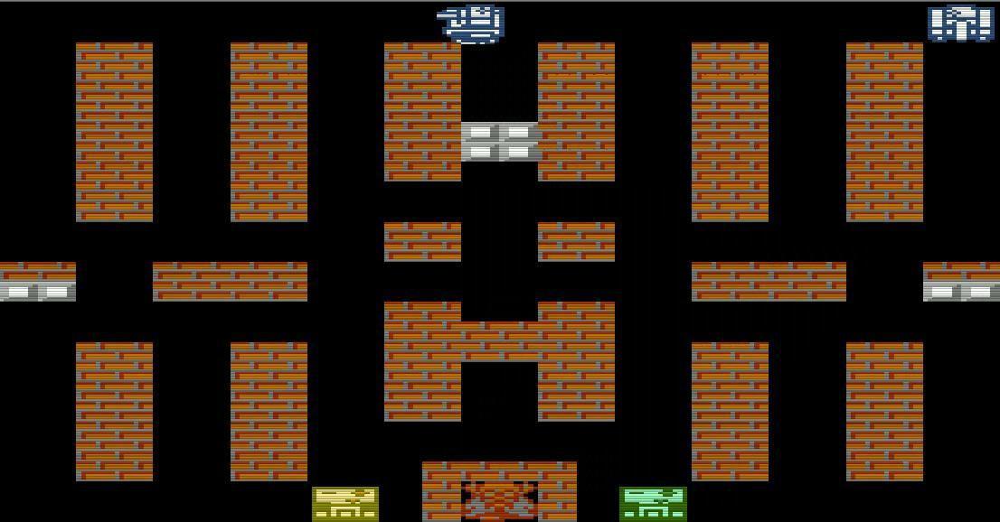
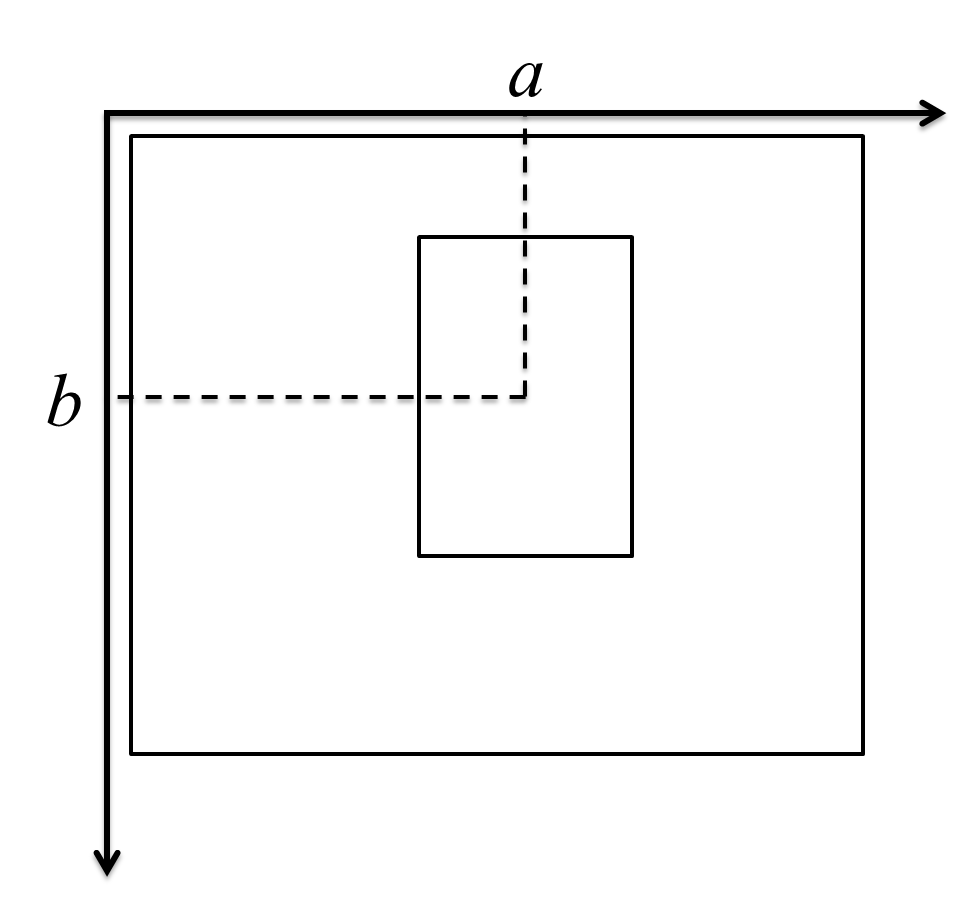

# Visual Tracking of Tanks in Battle City Using Particles Filters

## 1. Introduction

### 1.1 Review of Visual Object Tracking

Visual object tracking is a rapidly developing area in computer vision community. The purpose of visual object tracking is to track objects of interests in video or consecutive images. It has various applications such as car surveillance [1], smart room [2], augmented reality [3], etc. The tracking of real-world objects is challenging as a result of environment noise, occlusion, objects interaction, object deformation, change of light, etc. Recently, Kevin Cannons made a comprehensive review of the models and techniques widely used in 2D visual tracking [4]. Other reviews in this field include [5], [6], and [7]. According to [4], common tools of visual object tracking include foreground detection, feature extraction, tracking models, and data association.

Foreground detection aims to detection the objects of interests, which is in contrast to background. Methods for foreground detection fall into three categories. The first category is background subtraction, which assumes a template of background without objects in it [8]. Then the targets are obtained by subtracting the background from the image. The second category is based on image difference. These methods assume moving objects in consecutive frames, which causes the difference in the active areas between temporal adjacent frames. Typical methods include two-frame difference [9], three-frame difference [10], and motion coherence energy [11]. The first two categories assume static camera with static background. To handle non-static cases, additional efforts are necessary to calibrate the background. The third category includes target spotting approaches, which assumes reliable templates for targets [12]. Detectors are trained to compare features from the suspicious region and the template to determine the presence of objects.

Feature extraction methods play an important role in visual object tracking. The aim of feature extraction is to characterize an object as well as to distinguish it from the background and other objects. Good features are able to uniquely identify a certain object from the environment and  are insensitive to the deformation or occlusion of the target. Popular features include discrete features, interest points, and regional features. Discrete features include edges and lines of the object which can be detected by edge detectors. Canny's edge detector is one of the most widely used edge detectors currently [13]. Interest points is another class of image features such as the center of a corner.   Regional features describe the characteristic of a region in an image. Color histogram is a typical regional feature, which characterize a region by its histogram of RGB (red, green, blue) values or HSV (hue, saturation, brightness) values [14]. Color histogram gains its popularity since its simplicity, light computation, and insensitivity to occlusions or scales.

According to whether a method makes predictions, a tracking model can be classified into deterministic method or stochastic method [15]. Deterministic methods typically track by iteratively seeking a region in an image which has maximum similarity with a given template. Mean-shift algorithm is a typical deterministic method [14]. In contrast, stochastic methods employ statistical models such as Kalman filters and particle filters for object tracking [16]. These models execute prediction and updating repetitively. Kalman filters are based on the Gaussian assumption which particle filters use Monte Carlo representation to relieve this constraint.

When multiple objects are detected, data association techniques help to recognize the same object in different frames, in order to reveal the temporal motion for each object. The simplest data association method is nearest neighbor algorithm [17] which associate two objects by minimum spatial distance.

### 1.2 Description of the Project

"Battle City" is a famous electronic game where one or two players each controls a tank and fires on enemies in a predefined map. A scene of the game is displayed in Figure 1.

The yellow and the green rectangles at the bottom of the image are tanks controlled by the players. The red and white bricks denote walls, and the white tanks are enemies. In this paper, we apply visual object tracking methods to the game "Battle City" with the following considerations:

- The background is static and simple.
- The objects are very different in color with the environment.
- The popularity of this game will make this application interesting.

Our aim is to track the one or two tanks controlled by the players. Since Kalman filters make the assumption of Gaussian distribution, initialization becomes critical. As a result, Kalman filters need foreground detection methods or manual annotation for the initial position of tanks. They also need foreground detection and data association methods to obtain measurements and update states. On the other side, particle filters are able to handle unknown initial position and nonlinear measurement models, which will relieve us from image processing works. Therefore, we select particles filters which will be described in detail in Section 2. In our method, it is not necessary to adopt any foreground detection or data association techniques.

Similar to target spotting in foreground detection, we use templates for each objects and compare them with suspicious regions. More specifically, we compare the features extracted from templates and suspicious regions. As mentioned before, the tanks have distinguishable colors, and color-based features usually require less computation, which makes regional color-based features favorable in our case. In this work, we adopt the features raised in [18] since its simplicity and rapid calculation. It also retains spatial information compared to traditional color histograms.

I use multiple templates for each targets. An object may have different appearance and features in different environments, orientations, status, etc. In our case, the appearance of a tank depends on its orientation. As shown in Figure 2, four templates are adopted for a single object which depict the appearance of the object when its orientation is upward, downward, rightward, and leftward respectively.

This study is mainly based on [15]. In [15], the authors combine contour features and color features in the measurement model of the particle filter. While in this study, only color features are incorporated. Furthermore, we adopt a similar structure that each object is associated with an independent particle filter. This is based on the contrasting color between objects. According to [19], the interaction between similar objects easily cause "hijacks" when lots of particles for one object converge to another. In our case, considering the significant difference between objects, "hijacks" are unlikely to happen and we avoid high-dimensional state space and complex models (e.g. Markov random field) by this structure.

## 2. Method

### 2.1 Particle Filters

Particle filter is a combination of Monte Carlo approach and Bayesian filter. A Bayesian filter considers two stochastic processes, the states $X_t$ and the measurements $Y_t$, where $t=1,2,\cdots $ denotes time. The temporal relationship between adjacent states is depicted by prediction probability $P(X_t|X_{t-1})$. The relationship between state and measurement is depicted by emission probability $P(Y_t|X_t)$. Prediction and updating are iteratively executed. In prediction, the next state at time $t$, $X_t$, is predicted based on the previous $t-1$ measurements.
$$
	P(X_t|Y_1, \cdots, Y_{t-1})=\int P(X_t |X_{t-1}) P(X_{t-1}|Y_1, \cdots, Y_{t-1}) dX_{t-1}
$$
When the measurement at time $t$ arrives, the posterior probability of $X_t$ is updated as
$$
	P(X_t|Y_1,\cdots,Y_{t-1},Y_t) \propto P(X_t|Y_1, \cdots, Y_{t-1}) P(Y_t |X_t)
$$

In particle filter, a number of samples $x_{t,1}, x_{t,2}, \cdots, x_{t,n}$ are used to represent the random variable $X_t$. The prediction step changes to
$$
	\mbox{sample } \bar{x}_{t,i} \sim P(X_t | x_{t-1,i}), \quad i=1,2,\cdots, n
$$
And the updating step changes to
$$
	\mbox{sample } \{x_{t,i}\}_{i=1}^n \mbox{ from } \{\bar{x}_{t,i}\}_{i=1}^n \mbox{ according to weight } w_{t,i}=P(Y_t | \bar{x}_{t,i})
$$

Practically, the prediction probability $P(X_t|X_{t-1})$ and emission probability $P(Y_t|X_t)$ are unknown, and need to be inferred from prediction model and measurement model. The next subsection will elaborate the prediction and measurement model employed in this study.

### 2.2 Prediction Model

In this study, we concern the position of tanks. An object is defined as a rectangular area which surrounds the tank. The state is defined as
$$
	X_t = \begin{pmatrix}
	a_t \\
	b_t
	\end{pmatrix}
$$
where $a_t$ and $b_t$ are horizontal and vertical coordinate of the object, as shown in Figure 3.

The prediction model is
$$
	X_{t}=X_{t-1}+\epsilon_{t-1}
$$
where $\epsilon_{t-1}$ is a random Gaussian noise with zero mean and covariance $\Sigma_{\epsilon}$. Therefore, the prediction is
$$
	\bar{x}_{t,i}=x_{t-1,i}+\epsilon_{t-1,i}
$$
for each particle, where $\epsilon_{t-1,i}$ is a random sample of $\epsilon_{t-1}$.

### 2.3 Measurement Model

Given a template of the object, the measurement model is defined as
$$
	Y_t=Y^*+\delta_{t-1}
$$
where $Y^*$ is the feature extracted from the template, $\delta_{t-1}$ is a zero-mean Gaussian noise with covariance $\Sigma_{\delta}$. And
$$
	Y_t=h(X_t)
$$
where $h(X_t)$ means the extraction of features from a rectangle area, the center of which is defined by $X_t$ and its size is equal to the size of the template.

Therefore, the weight of each predicted particle can be calculated as
$$
	w_{t,i}=\Phi(h(\bar{x}_{t,i})-Y^*,0,\Sigma_{\delta}) \propto \exp[(h(\bar{x}_{t,i})-Y^*)^T Q^{-1} (h(\bar{x}_{t,i})-Y^*)]
$$
where $\Phi(z,\mu,\Sigma)$ is the likelihood at $z$ for Gaussian distribution with mean $\mu$ and covariance $\Sigma$. In our study, we set the covariance matrix $\Sigma_{\delta}=\sigma^2 I$ where $I$ is the identity matrix and $\sigma$ is a scalar. Then the equation above simplifies to
$$
	w_{t,i} \propto \exp \left[ \frac{1}{\sigma^2}\sum_{j=1}^m (h_j(\bar{x}_{t,i})-Y_j^*)^2 \right]
$$
where the subscript $j$ means the $j$th entry of a vector, and $m$ is the dimension of features.

### 2.4 Feature Extraction

We adopted the rectangle color features proposed by [18] as it is simple, easy-to-calculate, and retains spatial information. To extract features from a rectangle region of a grayscale image, the region is at first divide into $K_1 \times K_2$ small rectangles. Each small rectangle has approximately the same size. An average value of each small rectangle is calculated and concatenated as a vector. For an RGB true color image, the same operations are applied for each of the three layers, and the resulting average values form a feature vector.

The calculation of the average value for each small rectangle is based on the integral format of the image [18]. In the integral format, the value at $(a,b)$ is calculated as
$$
	R'(a,b)=\sum_{i\leq a} \sum_{j\leq b} R(i,j)
$$
where $R'(a,b)$ is the value at $(a,b)$ in integral format, and $R(a,b)$ is the value at $(a,b)$ in original format. Suppose the left-top corner of a small rectangle $R_i$ is located at $(a_L, b_T)$, and the right-bottom corner is located at $(a_R, b_B)$, then the average value can be calculated as
$$
	\bar{R}_i =\frac{1}{|R_i|}\left[ R'(a_L,b_T)+R'(a_R, b_B)-R'(a_L, b_B) - R'(a_R, b_T) \right]
$$
where $\bar{R}_i$ denotes the average value, and $|R_i|$ denotes the number of pixels in $R_i$.

A drawback of this feature is the influence from the background. The feature extraction method assumes that objects are rectangles. When objects are not rectangular, an extra of background will be incorporated into the feature vector, which leads to nonstability of features. To decrease the influence, a weight can be attached to each element in the feature vector. For small rectangles located in the middle of the object, the weights are large. And for small rectangles located on the edge of the object, the weights are small. Then the measurement model in Section 3.3 can be modified as
$$
	w_{t,i} \propto \exp \left[ \frac{1}{\sigma^2}\sum_{j=1}^m w'_j(h_j(\bar{x}_{t,i})-Y_j^*)^2 \right]
$$
here $w'_j$ is the weight for the $j$th entry in the feature vector.

### 2.5 Multiple Templates

As mentioned before, a tank can have four different appearances. Therefore, a single target should have multiple templates. For each template $j$, we calculate the weight $w_{i,j}$ for each predicted particle $\bar{x}_{t,i}$ using our measurement model. And the final weight of a particle $\bar{x}_{t,i}$ is the maximum weight in $\{ w_{i,1},w_{i,2},\cdots \}$. Associate with each final weight, a template is selected for each particle. The template which is selected most of the times is considered as the expected template, which defines the width and height of the object.

## 3. Experiments

### 3.1 Experiment Description

The program was implemented on the platform MATLAB 2010b. Two cases were considered: the first case had only one target (single player), and the second case had two targets (two players). In both cases, one target had four templates depicting the appearance of the tank in four orientations.

In our study, each object was tracked by an independent particle filter. In initialization of each particle filter, particles were randomly generated to cover the entire image. After some steps, particles were expected to converge to their objects. Therefore, we solved a global localization problem.

The covariance of the noise in prediction model was set as
$$ 
	\Sigma_{\epsilon}=\begin{bmatrix}
	2500 & 0 \\
	0 & 2500
	\end{bmatrix}
$$
and the variance of the noise in measurement model was set as $\sigma=100$. The number of particles for each particle filter is 1000. Since tanks were approximately rectangular, all dimensions of the feature vector were regarded as equal weight.

### 3.2 Experiment Results

The first case consists four templates and 1876 consecutive images in size $1106 \times 578$. The second case consists eight templates and 1625 consecutive images in the same size. Since the second is more general than the first case, I only describe the result of the second case here.

The particles begin with global randomness. Figure 4 depicts the particles and estimations of two tanks after one iteration of prediction and updating. The red points are particles of the yellow tank (left), and the blue points are particles of the green tank (right). The red and blue rectangles are the expected position of the two tanks respectively. In this figure, particles tend to concentrate on the walls, and only a few particles are located at black areas.

After five steps, particles converge rapidly, as Figure 5 shows.

The tracking of the yellow tank is less stable than the tracking of the green tank, which can also be seen in Figure 6. An explanation is that the yellow tank is less different with the color of walls than the blue tank, in RGB values.

In conclusion, our method successfully tracks the two tanks. The output video is displayed below

<iframe width="560" height="315" src="//www.youtube.com/embed/d-xK6DuUcZQ" frameborder="0" allowfullscreen></iframe>

## 4. Summary and Conclusions

This study employs particle filters to track tanks in the famous game "Battle City". Rectangle color features are used as measurements. Each object is tracked by an independent particle filter. One contribution of this study is the utilization of multiple templates to solve the problem when targets have different appearance in different occasions. The results of the experiments show that our method is capable to track the targets of interests.

## 5. Acknowledgement

This is a course project for "Applied Estimation" in KTH, Sweden. Thank Prof. Folkesson for his instruction. Also thank Yixing Liu, my partner in this project, for her effort.

## Reference

[1] Dieter Koller, Joseph Weber, and Jitendra Malik. *Robust multiple car tracking with occlusion reasoning*. Springer, 1994.

[2] Stephen S Intille, James W Davis, and Aaron F Bobick. Real-time closed-world tracking. In *Computer Vision and Pattern Recognition, 1997. Proceedings., 1997 IEEE *Computer Society Conference on*, pages 697-703. IEEE, 1997.

[3] Rajeev Sharma and Jose Molineros. Role of computer vision in augmented virtual reality. In *IS&T/SPIE's Symposium on Electronic Imaging: Science & Technology*, pages 220-231. International Society for Optics and Photonics, 1995.

[4] Kevin Cannons. A review of visual tracking. *Dept. Comput. Sci. Eng., York Univ., Toronto, Canada, Tech. Rep. CSE-2008-07*, 2008.

[5] Hanxuan Yang, Ling Shao, Feng Zheng, Liang Wang, and Zhan Song. Recent advances and trends in visual tracking: A review. *Neurocomputing*, 74(18):3823-3831, 2011.

[6] Pierre F Gabriel, Jacques G Verly, Justus H Piater, and Andre Genon. The state of the art in multiple object tracking under occlusion in video sequences. In *Advanced Concepts for Intelligent Vision Systems*, pages 166-173, 2003.

[7] Alper Yilmaz, Omar Javed, and Mubarak Shah. Object tracking: A survey. *Acm computing surveys (CSUR)*, 38(4):13, 2006.

[8] Christopher Richard Wren, Ali Azarbayejani, Trevor Darrell, and Alex Paul Pentland. Pfinder: Real-time tracking of the human body. *Pattern Analysis and Machine Intelligence, IEEE Transactions on*, 19(7):780-785, 1997.

[9] CH Anderson, PJ Burt, and GS Van Der Wal. Change detection and tracking using pyramid transform techniques. In *1985 Cambridge Symposium*, pages 72-78. International Society for Optics and Photonics,1985.

[10] Daniel J Dailey, Fritz W Cathey, and Suree Pumrin. An algorithm to estimate mean traffic speed using uncalibrated cameras. *Intelligent Transportation Systems, IEEE Transactions on*, 1(2):98-107, 2000.

[11] Markus Enzweiler, Richard P Wildes, and Rainer Herpers. Unified target detection and tracking using motion coherence. In *Application of Computer Vision, 2005. WACV/MOTIONS'05 Volume 1. Seventh IEEE Workshops on*, volume 2, pages 66-71. IEEE, 2005.

[12] Kenji Okuma, Ali Taleghani, Nando De Freitas, James J Little, and David G Lowe. A boosted particle filter: Multitarget detection and tracking. In *Computer Vision-ECCV 2004*, pages 28-39. Springer, 2004.

[13] John Canny. A computational approach to edge detection. *Pattern Analysis and Machine Intelligence, IEEE Transactions on*, (6):679-698, 1986.

[14] Dorin Comaniciu, Visvanathan Ramesh, and Peter Meer. Kernel-based object tracking. *Pattern Analysis and Machine Intelligence, IEEE Transactions on*, 25(5):564-577, 2003.

[15] Changjiang Yang, Ramani Duraiswami, and Larry Davis. Fast multiple object tracking via a hierarchical particle filter. In *Computer Vision, 2005. ICCV 2005. Tenth IEEE International Conference on*, volume 1, pages 212-219. IEEE, 2005.

[16] S. Thrun, W. Burgard, and D. Fox. *Probalistic robotics*. MIT Press, 2005.

[17] James L Crowley, Patrick Stelmaszyk, and Christophe Discours. Measuring image flow by tracking edge-lines. In *Computer Vision., Second International Conference on*, pages 658-664. IEEE, 1988.

[18] Paul Viola and Michael J Jones. Robust real-time face detection. *International journal of computer vision*, 57(2):137-154, 2004.

[19] Zia Khan, Tucker Balch, and Frank Dellaert. An mcmc-based particle filter for tracking multiple interacting targets. In *Computer Vision ECCV 2004*, pages 279-290. Springer, 2004.