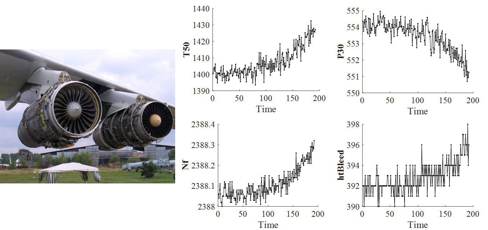
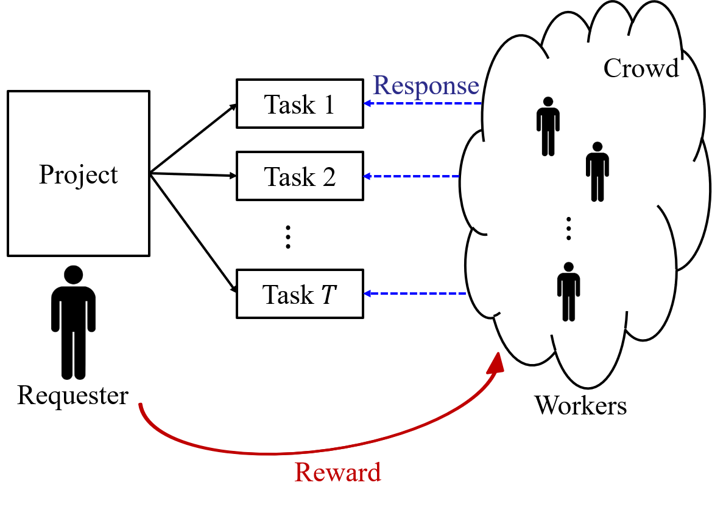

# Research Applications
Currently there are three applications for my research, including degradation modeling (manufacturing), crowdsourcing (business serivce), and disease screening with wearable devices (health care). 
## Degradation
A battery cannot be used forever without recharging. A machine break down after a long period of usage. Alzheimer's disease gradually worsens over time without intervention. Degradation is one of the most common processes in the world that are generally monotonic and leads to an event such as system failure and disease onset. Therefore, sensors are widely used to monitor the degradation process of systems with the help of Internet of Things (IoT). By analyzing the collected sensor signals, it is possible to infer the current system status and predict the future trend of the process.

However, great challenges exist in analyzing the data because of the
1) diversity: data can be from different sources in different formats;
2) complexity: data are generally inter-related;
3) uncertainty: data usually contains noise, and the process is usually random;
4) redundancy: some data may be non-informative; and
5) interpretability: data analytics usually require the incorporation of domain knowledge.

My research focuses on degradation modeling, inference, and prognosis based sensor signals, especially if multiple sensors are used to monitor a single system simultaneously.

## Crowdsourcing
Crowdsourcing is a prompt and cost-effective way of solving intelligence-intensive tasks that are difficult for computers but relatively easy for human beings. In a crowdsourcing system, a project is split into many tasks and then assigned to a crowd of individuals called workers. Workers will provide response to each task and obtain some reward. The previous versions of the reCAPTCHA system, the Wikipedia, and various rating systems are examples of crowdsourcing. In the new era of artificial intelligence and large-scale machine learning, crowdsourcing is an effective way of obtaining the true labels for the training data. One problem of crowdsourcing is that workers can make mistakes. To solve this problem, one task is usually assigned to multiple workers, and the resulting multiple responses are combined into the final answer. This requires the data analytics in modeling the worker response and inferring the true answer, which is the focus of my research.

## Apea
Obstructive sleep apea is a kind of disease. When a patient is in sleep, the occurrence of apnea will obstruct the airflow in breath, leading to snoring and daytime fatigue, and reducing the life quality. Current diagnosing tool Polysomnography (PSG) is expensive and time-consuming. In my research, the objective is to detect apea based on ECG signals. Since the ECG signals are collected by wearable devices, this can reduce the health care cost.